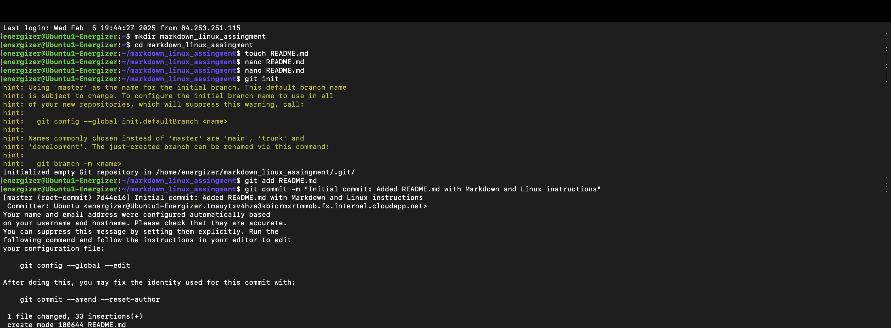
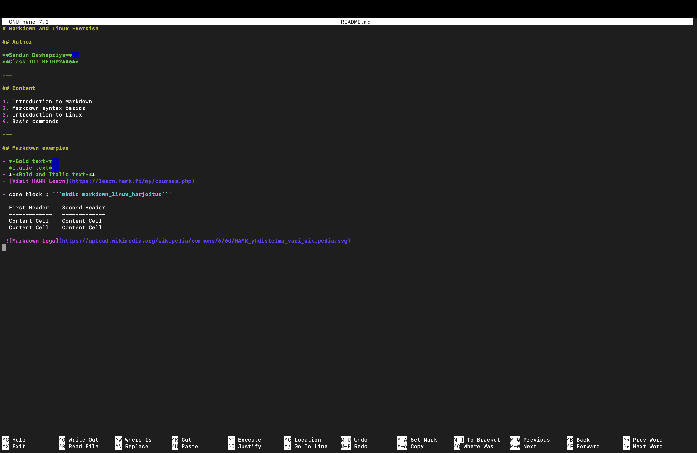

# Markdown and Linux Exercise

## Author

**Sandun Deshapriya**  
**Class ID: BEIRP24A6**

---

## Content

1. Introduction to Markdown 
2. Markdown syntax basics
3. Introduction to Linux
4. Basic commands

---

## Markdown examples

- **Bold text**  
- *Italic text*  
- ***Bold and Italic text***
- [Visit HAMK Learn](https://learn.hamk.fi/my/courses.php)

- code block : ```mkdir markdown_linux_harjoitus```

| First Header  | Second Header |
| ------------- | ------------- |
| Content Cell  | Content Cell  |
| Content Cell  | Content Cell  |

 

## Assignment Step 2 & 3
Following images are the terminal commands used as per the assignment. 



However, I need to learn further on how to link the repository remotely to the github and push using linux command